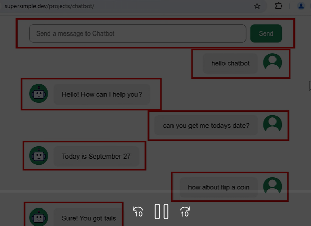

React is an **external library** that helps us create websites
Html code creates a website.\
Script element can load js from anywhere in the internet
React is a bunch of code that is outside of our computer.\
This version of react is just used here so that the tutorial is controlled by the exact version .
## Using react to create websites
Load react & reactDOM
## Using react to create mobile apps
Load react & reactNative

# Babel
Babel transaltes other languages into Javascript. When using react, we use a enhanced version of Javascript called JSX, JAVASCRIPT XML, We can write html code directly in our javascript code

Our web broswer however do not understand what JSX is, so we need to transalate JSX to Js\ 
to do that we use Babel external library


# Features of react
## Displaying elements in react
```jsx
<!DOCTYPE html>
<html>
  <head>
    <title>React Basics</title>
  </head>
  <body>
    <div class="js-container"></div>
    <script src="react-basics.js"></script>
    <script src="https://unpkg.com/supersimpledev/react.js"></script>
    <script src="https://unpkg.com/supersimpledev/react-dom.js"></script>

    <script src="https://unpkg.com/supersimpledev/babel.js"></script>
    <script type="text/babel"> //this tells babel to tell to convert jsx to js
      

      const div = <div>
        <button>Hello</button>
        <p>Paragraph</p>
        </div>;

      const container = document.querySelector('.js-container');
      ReactDOM.createRoot(container).render(div); 
      //everything we create is put in this container, and will not effect anything outside this container.
    </script>
  </body>
</html>
```

# Component
Component is jsut a piece of the website. One piece can be the textbox, button, chat messages.

When building websites, better to split it into pieces or components, small piece at a time can be worked up upon.


## Creating our first component
Component name must start with a captial (Pascal Case) 

```jsx
//to create a  component
      function ChatInput ()
      {
        return (
          <input></input> //in normal html we dont need to close input, but here we need to or
          <input />
        );
      }
```

```jsx
//to create a  component
      function ChatInput ()
      {
        return (
          
          <input />
          <button> Send </button>
        );// we try to return two, but we can actually return only one, so for that we can use div to group em up
      }
```

```jsx
const div = (
        <div>
          {ChatInput()} //this will insert the html into this curly brackets after running the function. 
        </div>
      );
```

## React has a special option to insert components
```
const div = (
        <div>
          <ChatInput></ChatInput>
        </div>
      );
```
Now using react we can create our own html element like chatinput here and use it to build the website instead of using the default elements\

## Fragments
<>\
</>
We can use this if we wanna avoid div
```jsx
//to create a  component
      function ChatInput ()
      {
        return (
          <>            
            <input />
            <button> Send </button>
          </>
        );
      }
```

## Props (Properties) 
```jsx
function ChatMessage(props)      
{
  console.log(props) //props contains this
  // Object
  // message : "hello chatbot"
  // [[Prototype]] : Object
  return(
    <div>
      hello chatbot
      
    </div>
  );
}
const app = (
  <>
    <ChatInput/>
    <ChatMessage message="hello chatbot"/> //you can create own attributes as well over here
    
  </>
);
```
you can also
```jsx
console.log(props.message);
```